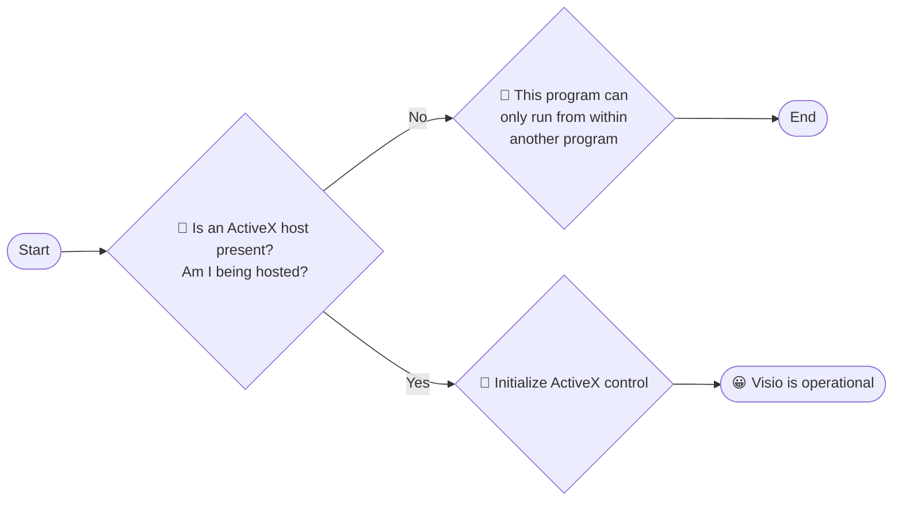
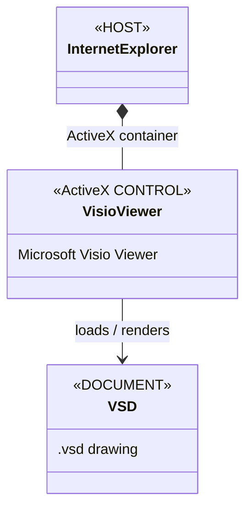
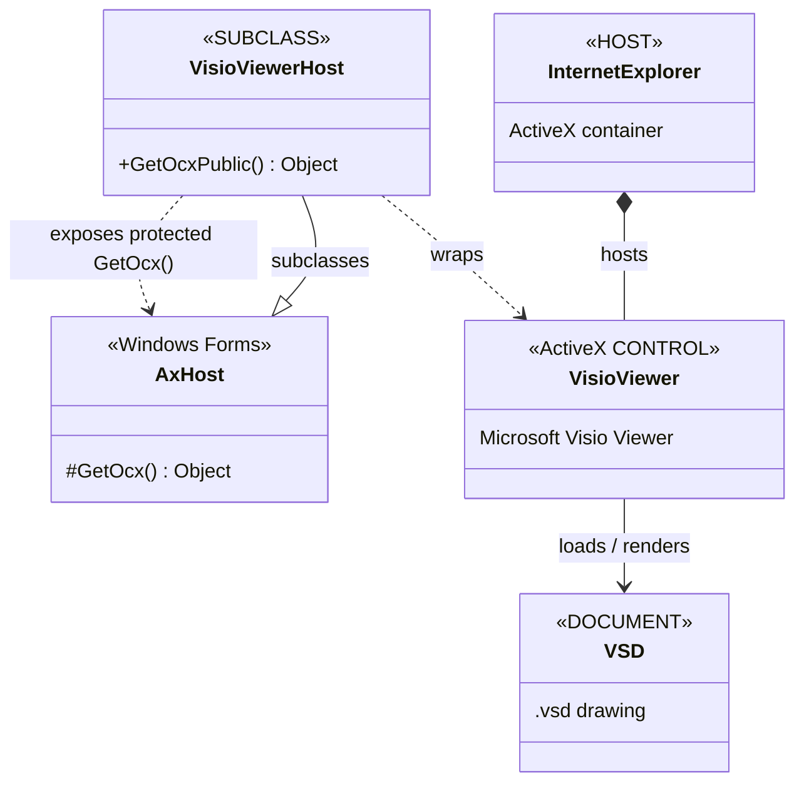

> This program can only run from within another program.
>
> OK ?

This isn't merely a *"Wake up, Neo. The Matrix has you"* / *Office refuses to start* moment. 

The message is unusually honest: it is telling you that the `.EXE` is **not the application in the normal sense**.

If the thing you found is [Free Visio Viewer](https://www.microsoft.com/en-us/microsoft-365/visio/free-visio-viewer) 
 (`VPREVIEW.EXE`), then the exotic behavior is intentional. 
 
Microsoft documented it as an ActiveX control hosted by Internet Explorer, rather than a standalone viewer. A Microsoft Q&A answer explicitly says it was designed to run from within a browser, and contemporary testing confirms that launching VPREVIEW.EXE directly produces exactly that message.

> CAUTION! Desktop app requires some kind of installation. Consider the risks!
> NOTE:  the default page contains *no* download link. The real download is available on [old page](https://www.microsoft.com/en-us/microsoft-365/blog/2012/11/28/download-the-free-microsoft-visio-viewer) [link](https://www.microsoft.com/en-us/download/details.aspx?id=35811)


Rather than trying to find a magic command-line switch,  determine what kind of PE object it actually is.

```cmd
strings VPREVIEW.EXE | findstr /ic:"ActiveX COM OLE IE browser"
```
```text
P:\Target\x64\ship\visiomisc\x-none\vpreview.pdb
VPREVIEW.EXE
IEAWSDC.DLL
IEAWSDC.DLL.x86
CLVIEW.EXE
LSTVIEWS.INI
FPClientNonBootFilesIntl_1033
ClviewFilesIntl_1033
CLVIEW
FPClientNonBootFiles
PKEYCONFIG.COMPANION.DLL.CLIENT
IEAWSDC.DLL.x64
UICaptionsCompanionIntl_1033
ClviewFiles
VisioPreviewerFiles
PubComPrintingEnRGBCMYK
mso\osrclient.cpp
GetClientRect
ole32.dll
_commode
UnmapViewOfFile
MapViewOfFile
CreateIoCompletionPort
GetQueuedCompletionStatus
PostQueuedCompletionStatus
CompareStringW
CompareStringEx
CoMarshalInterface
AddAccessDeniedAce

<assembly xmlns="urn:schemas-microsoft-com:asm.v1" manifestVersion="1.0">
        name="vpreview"
<description>Microsoft Office Visio Previewer</description>
<trustInfo xmlns="urn:schemas-microsoft-com:asm.v3">

```

```powershell
HKEY_CLASSES_ROOT\Typelib\{BA35B84E-A623-471B-8B09-6D72DD072F25}\1.5
Microsoft Visio Viewer 15.0 Type Library
```
```powershell
$p = 'SOFTWARE\Classes\CLSID\{F8CF7A98-2C45-4c8d-9151-2D716989DDAB}\InprocServer32'
get-itemproperty -path "HKLM:\${p}" -name '(default)'|select-object -expandproperty '(default)'
```
```text
C:\PROGRA~1\MICROS~4\Office15\VVIEWER.DLL
```
```powershell
get-itemproperty -path 'HKLM:\SOFTWARE\Classes\WOW6432Node\CLSID\{F8CF7A98-2C45-4c8d-9151-2D716989DDAB}\InprocServer32' -name '(default)'|select-object -expandproperty '(default)'
```
```text
C:\PROGRA~1\MICROS~4\Office15\VVIEWER.DLL
```

```powershell
$p = 'SOFTWARE\Classes\CLSID\{F8CF7A98-2C45-4c8d-9151-2D716989DDAB}\ProgID'
get-itemproperty -path "HKLM:\${p}" -name '(default)'|select-object -expandproperty '(default)'
```
```text
VisioViewer.Viewer.1
```
```powershell
$p = 'SOFTWARE\Classes\CLSID\{F8CF7A98-2C45-4c8d-9151-2D716989DDAB}\VersionIndependentProgID'
get-itemproperty -path "HKLM:\${p}" -name '(default)'|select-object -expandproperty '(default)'
```
```text
VisioViewer.Viewer
```

> NOTE: the following will fail
> ```powershell
> $p = 'SOFTWARE\Classes\CLSID\{F8CF7A98-2C45-4c8d-9151-2D716989DDAB}'
> get-itemproperty -path "HKLM:\${p}" -name 'ProgID'|select-object -expandproperty 'ProgID'
> ```
> ```text
> Property ProgID does not exist at path ...
> ```

```powershell
p = 'SOFTWARE\Classes\Typelib\{BA35B84E-A623-471B-8B09-6D72DD072F25}\1.5\0\win32'
get-itemproperty -path "HKLM:\${p}" -name '(default)'|select-object -expandproperty '(default)'
```
```text
C:\PROGRA~1\MICROS~4\Office15\VVIEWER.DLL
```

```powershell
$p = 'SOFTWARE\Classes\CLSID\{21E17C2F-AD3A-4b89-841F-09CFE02D16B7}\LocalServer32'
get-itemproperty -path "HKLM:\${p}" -name '(default)'|select-object -expandproperty '(default)'
```
```text
C:\PROGRA~1\MICROS~4\Office15\VPREVIEW.EXE
```
```powershell
$p = 'SOFTWARE\Microsoft\Internet Explorer\Main\FeatureControl\FEATURE_ADDON_MANAGEMENT'
get-itemproperty -path "HKLM:\${p}" -name 'VPREVIEW.EXE'|select-object -expandproperty 'VPREVIEW.EXE'
```
```text
1
```

```powershell
$p = 'HKEY_LOCAL_MACHINE\SOFTWARE\Microsoft\Internet Explorer\Main\FeatureControl\FEATURE_HTTP_USERNAME_PASSWORD_DISABLE'
$p  = $p -replace 'HKEY_LOCAL_MACHINE\\', ''
get-itemproperty -path "HKLM:\${p}" -name 'VPREVIEW.EXE'|select-object -expandproperty 'VPREVIEW.EXE'
```
```text
1
```

```powershell
$p = 'HKEY_LOCAL_MACHINE\SOFTWARE\Microsoft\Internet Explorer\Main\FeatureControl\FEATURE_LOCALMACHINE_LOCKDOWN'
$p  = $p -replace 'HKEY_LOCAL_MACHINE\\', ''
get-itemproperty -path "HKLM:\${p}" -name 'VPREVIEW.EXE'|select-object -expandproperty 'VPREVIEW.EXE'
```
```text
1
```

```powershell
$p = 'HKEY_LOCAL_MACHINE\SOFTWARE\Microsoft\Internet Explorer\Main\FeatureControl\FEATURE_RESTRICT_ACTIVEXINSTALL'
$p  = $p -replace 'HKEY_LOCAL_MACHINE\\', ''
get-itemproperty -path "HKLM:\${p}" -name 'VPREVIEW.EXE'|select-object -expandproperty 'VPREVIEW.EXE'
```
```text
1
```
...more of the kind found under IE's own small *feature registry*, skipped

```powershell
$o = New-Object -ComObject 'VisioViewer.Viewer.1'
($o | Get-Member | SELECT-OBJECT -expandPROPERTY NAME ) -join ', '
```
```text
DisplayAbout, DisplayContextMenu, DisplayHelp, DisplayPropertyDialog, FollowHyperlink, GetErrorMessage, GetPageView, GetScrollbarInfo, Load, Paint, Pan, Render, SelectShape, SetPageView, Unload, ZoomToPoint, ZoomToRect, CustomPropertyCount, CustomPropertyName, CustomPropertyValue, HyperlinkAddress, HyperlinkCount, LayerColor, LayerColorOverride, LayerColorTrans, LayerDeleted, LayerName, LayerVisible, PageIDToIndex, PageIndexToID, PageName, ParentShape, ReviewerColor, ReviewerID, ReviewerInitial, ReviewerMarkupVisible, ReviewerName, ShapeAtPoint, ShapeIDToIndex, ShapeIndexToID, ShapeName, SubShapeAtPoint, AlertsEnabled, BackColor, BuildNumber, ContextMenuEnabled, CurrentPageIndex, DocumentLoaded, GridVisible, HighQualityRender, LastErrorCode, LayerCount, MajorVersionNumber, MarkupOverlaysVisible, MinorVersionNumber, PageColor, PageCount, PageTabsVisible, PageVisible, PreviewMode, PropertyDialogEnabled, ReviewerCount, ScrollbarsVisible, SelectedShapeIndex, ShapeCount, SizeGripVisible, SRC, ToolbarButtons, ToolbarCustomizable, ToolbarVisible, Zoom
```

```powershell

Add-Type -AssemblyName System.Windows.Forms
Add-Type -AssemblyName System.Drawing

$form = New-Object System.Windows.Forms.Form
$form.Text = 'Visio Viewer experiment'
$form.Width = 1000
$form.Height = 700
# https://learn.microsoft.com/en-us/dotnet/api/system.windows.forms.axhost.-ctor?view=netframework-4.5#system-windows-forms-axhost-ctor(system-string)

$host = New-Object System.Windows.Forms.AxHost '{F8CF7A98-2C45-4c8d-9151-2D716989DDAB}'
$host.Dock = 'Fill'

$form.Controls.Add($host)

$form.ShowDialog()

```

```text
New-Object : A constructor was not found. 
Cannot find an appropriate constructor for type System.Windows.Forms.AxHost.
```

the trick is exactly what the API design suggests: *subclass* `AxHost`, 
then expose the base *protected* constructor through the new class *public* constructor.

```powershell
Add-Type -AssemblyName System.Windows.Forms
Add-Type -AssemblyName System.Drawing

Add-Type @'
using System.Windows.Forms;

public class VisioAxHost : AxHost
{
    public VisioAxHost()
        : base("{F8CF7A98-2C45-4c8d-9151-2D716989DDAB}")
    {
    }
}
'@  -ReferencedAssemblies 'System.Windows.Forms.dll'


$form = New-Object System.Windows.Forms.Form
$form.Text = 'Visio Viewer'
$form.Width = 1000
$form.Height = 700

$viewer = New-Object VisioAxHost
$viewer.Dock = [System.Windows.Forms.DockStyle]::Fill

$form.Controls.Add($viewer)

$form.ShowDialog()

```

```text
WARNING: The generated type defines no public methods or properties.
```


### Background 

__Visio Viewer__ is an powerful [ActiveX control](https://en.wikipedia.org/wiki/ActiveX), 
enabling one to render drawings *inside* __Internet Explorer__,
and its __Viewer__ object is itself a programmable __ActiveX control__ 
- a famous deprecated Microsoft software component based on the 
[Component Object Model](https://en.wikipedia.org/wiki/Component_Object_Model) (__COM__) 
introduced to add interactive features to 
applications and web page in [Java Applet](https://en.wikipedia.org/wiki/Java_applet)-like fashion in 2000s.
that can also be hosted in plain [Windows Forms](https://en.wikipedia.org/wiki/Windows_Forms) class.

By using Microsoft Visio 2013 Viewer, Visio users can freely distribute Visio drawings (files with a .vsdx, .vsdm, .vsd, .vdx, .vdw, .vstx, .vstm, .vst, or .vtx extension) to team members, partners, customers, or others, even if the recipients do not have Visio installed on their computers. Internet Explorer also allows for printing, although this is limited to the portion of the drawing displayed.

Viewing Visio drawings is as simple as double-clicking the drawing file in Windows Explorer. Internet Explorer will open, and Visio Viewer will render the drawing in the browser window. You can then pan and zoom in the drawing window by using toolbar buttons, keyboard shortcuts, or menu items in the shortcut menu. Also, you can see properties on any shape by opening the Properties dialog box and then selecting a shape. Some rendering and display settings are available in the Display tab of the Properties dialog box. Additionally, you can set drawing-layer visibility and colors in the Layers tab, and comment visibility and colors in the Comments tab.

> Visio Viewer is implemented as an ActiveX control that loads and renders Visio drawings *inside* __Internet Explorer__


### Background

__Visio Viewer__ is a powerful [ActiveX control](https://en.wikipedia.org/wiki/ActiveX), enabling one to render drawings *inside* __Internet Explorer__. Its __Viewer__ object is itself a programmable __ActiveX control__ — a famous, now-deprecated Microsoft software component based on the [Component Object Model](https://en.wikipedia.org/wiki/Component_Object_Model) (__COM__).

ActiveX/COM components were widely used in the 2000s to add interactive functionality to Windows applications and web pages, in much the same spirit as [Java applets](https://en.wikipedia.org/wiki/Java_applet). The interesting part for this project is that the Visio Viewer ActiveX control can also be hosted directly in a plain [Windows Forms](https://en.wikipedia.org/wiki/Windows_Forms) application.


The `VPREVIEW.EXE` hosting exercise is essentially



or more precisely



 The host is providing an OLE/ActiveX container.

Historically, the __Internet Explorer__ plays the top shell role 

 a browser-hosted ActiveX component, the “another program” isn't some mystical Microsoft Office process. 

---
### Author
[Serguei Kouzmine](kouzmine_serguei@yahoo.com)
