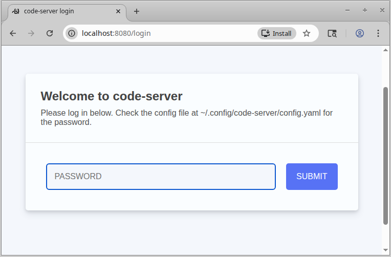
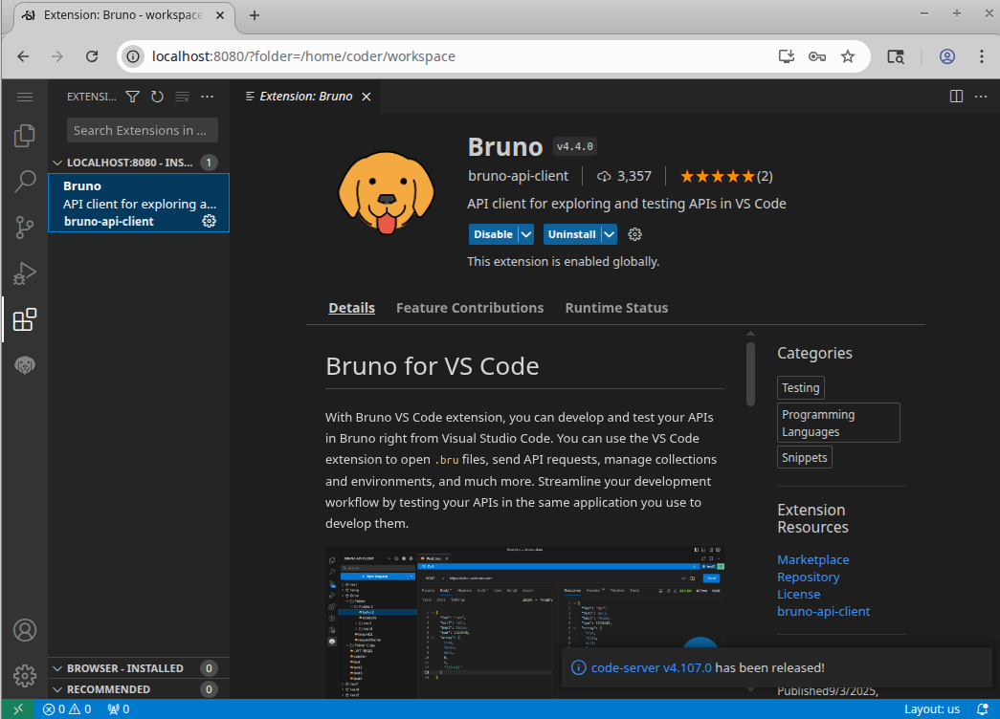
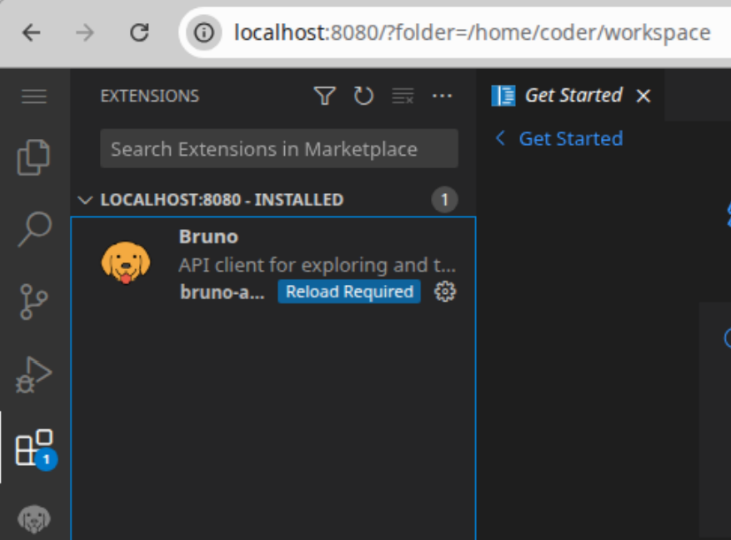

### Info
 this directory demonstrates installing  Visual Studio Code server silently in a light Docker container and also attempts to pre-install [Bruno](https://www.usebruno.com/) [API Client](https://www.usebruno.com/downloads) and [VS Code Extension](https://marketplace.visualstudio.com/search?term=bruno&target=VSCode&category=All%20categories&sortBy=Relevance)

### Testing

* Download extension


* build the image

```sh
docker pull ruanbekker/vscode-server:slim
```
```sh
docker build -t vscode-web -f Dockerfile .
```
```txt
Sending build context to Docker daemon  33.16MB
Step 1/17 : FROM ruanbekker/vscode-server:slim
...
Successfully built 3ffdf4cfb9fa
Successfully tagged vscode-web:latest
```
```sh
docker inspect ruanbekker/vscode-server:slim | jq '.[0].Config.Env'
```
```json
[
  "PATH=/usr/local/sbin:/usr/local/bin:/usr/sbin:/usr/bin:/sbin:/bin",
  "CODE_SERVER_VERSION=4.9.1",
  "HTTPS_ENABLED=false",
  "APP_BIND_HOST=0.0.0.0",
  "APP_PORT=8080",
  "USER=coder",
  "UID=1000",
  "GID=",
  "LANG=en_US.UTF-8",
  "SHELL=/bin/bash"
]
```


if the `USER` changes from `coder`, update `Dockerfile` accordingly
```sh
docker image ls vscode-web:latest
```
```text
REPOSITORY   TAG       IMAGE ID       CREATED          SIZE
vscode-web   latest    3ffdf4cfb9fa   36 seconds ago   899MB
```

link vscode container to some basic container.
```sh
docker pull clue/json-server
```

The `clue/json-server` image uses the `json-server` npm package to create a full fake __REST API__ from a single JSON file with zero coding. 

```sh
echo '{ "posts": [ { "id": 1, "title": "json-server", "author": "typicode" } ], "comments": [ { "id": 1, "body": "some comment", "postId": 1 } ], "profile": { "name": "typicode" } }' > ./db.json
```
```sh
APP='app'
docker run --name $APP -d -p 80:80 -v "$(pwd)/db.json:/data/db.json" clue/json-server
```
```sh
docker run -d -p 8080:8080 --link $APP vscode-web:latest
```
```text
52e9555e54fe3fad93dd7b67ad1a3472f102d7d7cf6b0dc4dee30d700d18b258
```
```sh
ID=$(docker ps --format '{{.ID}} {{.Image}}' | grep vscode-web:latest | cut -f 1 -d ' ')
```
```sh
echo $ID
```
```text
39732f250fec
```
```sh
docker exec -t $ID whoami
```

```text
coder
```


wait...

```sh
docker container ls
```
```text
CONTAINER ID   IMAGE               COMMAND                  CREATED          STATUS                             PORTS                                         NAMES
39732f250fec   vscode-web:latest   "/usr/bin/entrypoint…"   36 seconds ago   Up 35 seconds (health: starting)   0.0.0.0:8080->8080/tcp, [::]:8080->8080/tcp   romantic_jennings
```

until
```sh
docker container ls
```
```text
CONTAINER ID   IMAGE               COMMAND                  CREATED          STATUS                             PORTS                                         NAMES
39732f250fec   vscode-web:latest   "/usr/bin/entrypoint…"   36 seconds ago   Up 35 seconds (health: starting)   0.0.0.0:8080->8080/tcp, [::]:8080->8080/tcp   romantic_jennings
```
alternatively

```sh
until [ "$(docker inspect -f {{.State.Status}} $APP)" == "running" ]; do
  echo "Waiting for container ${APP} to be running..."
  sleep 2
done
```
> Note: there is no `.State.Health.Status`:
```text
template parsing error: template: :1:8: executing "" 
at <.State.Health.Status>: map has no entry for key "Health"
```



```sh
docker logs $ID
```
```text
[2025-12-20T02:04:20.392Z] info  code-server 4.9.1 f7989a4dfcf21085e52157a01924d79d708bcc05
[2025-12-20T02:04:20.393Z] info  Using user-data-dir ~/.local/share/code-server
[2025-12-20T02:04:20.408Z] info  Using config file ~/.config/code-server/config.yaml
[2025-12-20T02:04:20.408Z] info  HTTP server listening on http://0.0.0.0:8080/ 
[2025-12-20T02:04:20.408Z] info    - Authentication is enabled
[2025-12-20T02:04:20.408Z] info      - Using password from ~/.config/code-server/config.yaml
[2025-12-20T02:04:20.408Z] info    - Not serving HTTPS 
```

```sh
docker exec $ID cat /home/coder/.config/code-server/config.yaml
```
```text
bind-addr: 127.0.0.1:8080
auth: password
password: 0328d7c6d4e071b54ab175e0
cert: false
```
Log in




alternatively, use provided `docker-compose.yaml` and run

```sh
docker-compose up --build --detach
```
> NOTE: the old `docker-compose` version does not recognize `--wait`

```sh
DEPRECATED: The legacy builder is deprecated and will be removed in a future release.
            Install the buildx component to build images with BuildKit:
            https://docs.docker.com/go/buildx/

Sending build context to Docker daemon  33.36MB
Step 1/17 : FROM ruanbekker/vscode-server:slim
 ---> 03d71236aa80
Step 2/17 : ARG VERSION=4.4.0
 ---> Running in 7ba1481d3e39
 ---> Removed intermediate container 7ba1481d3e39
...
Successfully built 8f563d7c4dfa
Successfully tagged web_vscode-web:latest
Creating vscode-web ... done
Attaching to vscode-web
vscode-web    | [2025-12-20T02:56:07.996Z] info  code-server 4.9.1 f7989a4dfcf21085e52157a01924d79d708bcc05
vscode-web    | [2025-12-20T02:56:07.997Z] info  Using user-data-dir ~/.local/share/code-server
vscode-web    | [2025-12-20T02:56:08.013Z] info  Using config file ~/.config/code-server/config.yaml
vscode-web    | [2025-12-20T02:56:08.014Z] info  HTTP server listening on http://0.0.0.0:8080/ 
vscode-web    | [2025-12-20T02:56:08.014Z] info    - Authentication is enabled
vscode-web    | [2025-12-20T02:56:08.014Z] info      - Using password from ~/.config/code-server/config.yaml
vscode-web    | [2025-12-20T02:56:08.014Z] info    - Not serving HTTPS 
vscode-web    | [02:56:08] 
vscode-web    | 

```
```sh
docker-compose ps
```
```text
   Name             Command              State                  Ports           
--------------------------------------------------------------------------------
vscode-web   /usr/bin/entrypoint.sh   Up (healthy)   0.0.0.0:8080-              
                                                     >8080/tcp,:::8080->8080/tcp
```

```sh
docker-compose exec vscode-web cat /home/coder/.config/code-server/config.yaml
```

```text
bind-addr: 127.0.0.1:8080
auth: password
password: c518a1a61691354a9792e0e8
cert: false
```
Navigate to `http://localhost:8080/login` in the browser and provide password.  If seeing 




do reload


#### NOTE

if seeing 
```text
docker.errors.DockerException: Error while fetching server API version: Not supported URL scheme http+docker
```
upgrade/downgrade Python stack
```sh
pip uninstall docker -y
pip install docker 
```
```sh
pip list|grep requests
```
```text
requests                     2.32.4
```
```sh
pip install requests==2.31.0
```

### Bruno Desktop App / Debian package

The __Bruno__ Debian package `https://github.com/usebruno/bruno/releases/download/v3.0.2/bruno_3.0.2_amd64_linux.deb`
is just the desktop Electron/API client app that does not include the
CLI (command-line) tool that the VS Code extension expects.

The __Bruno CLI__ (a.k.a. `bru`) is separate
The CLI is published solely as an `npm` package named `@usebruno/cli`.
It provides the `bru` command one can run in terminals and that
the __VS Code extension__ expects for certain commands to be executed
before wrapping the error. 

```text
command 'bruno.createCollection' not found
```
```ext
command 'bruno.importCollection' not found
```

and similar “command not registered” problems. T

This is a symptom of the *extension running without its required CLI*. 

Troubleshooting involves trying to operate through Extention Host Developer Console.
e.g. 
```js
Developer: Reload Window
```
```js
```
### Verdict


Container / remote / browser VS Code will likely never work with Bruno extension reliably.
#### How To Install the Bruno CLI on Debian/Ubuntu

The official way (as documented) is via `npm`, since there isn’t a dedicated `.deb` for the CLI.


* Make sure you have Node.js installed (Recommended LTS — Node 18+).


* Install the CLI globally:
`npm install -g @usebruno/cli`

This installs the `bru` command. 


* Confirm it’s on your path:
```sh
which bru
bru --version
```


If your global npm binaries aren’t on `PATH` (common on __Debian__), add them:
```sh
export PATH=$PATH:$(npm bin -g)
```
recommended add that line to the user scope or system bash profile `~/.bashrc`.


* Verify VS Code Sees the CLI

Once installed:


+ Restart VS Code.
+ Open the Extension Output or Developer Tools Console (Help → Moore Tools → Developer Tools) and check for any errors.


If VS Code still complains, open the Developer Tools console to see errors — extension command registration failures often show more details there. 


### See Also

  * Visual Studio Code Server release announcement [blog](https://code.visualstudio.com/blogs/2022/07/07/vscode-server)
  * Visual Studio Code Server [documentation](https://code.visualstudio.com/docs/remote/vscode-server)

  * __Bruno__ git-friendly Opensource API client with collections version contro[docker image](https://hub.docker.com/r/alpine/bruno/tags)
  *  __Bruno__ [positions](https://www.usebruno.com/) it an Open source reinvented alternative to Postman with offline-first design and not a platform 

---

### Author
[Serguei Kouzmine](kouzmine_serguei@yahoo.com)
